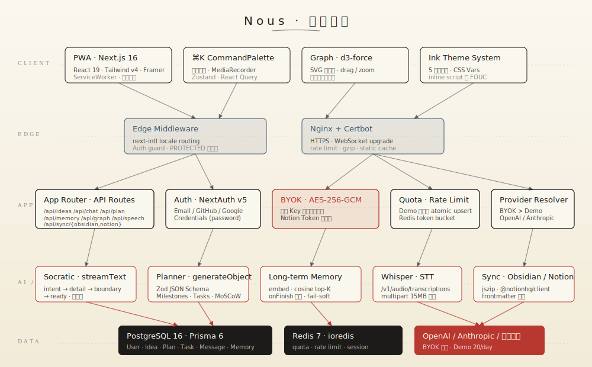

# Nous · 架构文档

> 把「想法 → 行动」的 AI 翻译器拆开看。

本文档面向三类读者：
- **贡献者** · 在哪改、改了会影响什么
- **自托管者** · 运行时需要什么、怎么监控
- **对内部好奇的用户** · Nous 的决策流程透明可审

<br />

<div align="center">
  
</div>

<br />

---

## 五层设计

| 层 | 职责 | 目录 |
|---|---|---|
| **Client** | PWA · 界面 · 用户输入 · 客户端动画 | `app/`（client components）· `components/` |
| **Edge** | 路由鉴权 · i18n · HTTPS · 速率 | `proxy.ts`（Next middleware）· `docker/nginx/` |
| **App** | API Routes · 领域逻辑 · 凭证解析 · 配额 | `app/api/` · `lib/auth` · `lib/ai/providers` |
| **AI / Integrations** | Socratic / Planner / Memory / Whisper / Sync | `lib/ai/` · `lib/memory/` · `lib/sync/` |
| **Data** | Postgres（主库）· Redis（缓存）· 外部模型 | `prisma/` · `lib/redis.ts` |

---

## 数据流：一条想法的一生

```
   ┌──────────────┐     POST /api/ideas       ┌──────────────┐
   │  ⌘K Palette  │ ────────────────────────▶ │   Prisma     │
   │ (voice/text) │                           │ Idea(status=raw)
   └──────┬───────┘                           └──────┬───────┘
          │ 麦克风 → Whisper → text                  │
          ▼                                          ▼
   ┌──────────────┐    POST /api/chat   ┌─────────────────────────┐
   │  RefineView  │ ───stream SSE────▶ │  Socratic (streamText)  │
   │              │                     │  + Memory retrieve top-K│
   └──────────────┘                     └────────────┬────────────┘
                                                     │ onFinish
                          ┌──────────────────────────┴───────────────┐
                          ▼                                          ▼
              ┌─────────────────────┐                 ┌─────────────────────┐
              │ Message persist     │                 │ Memory extract       │
              │ (user + assistant)  │                 │ (detail/boundary only)│
              └─────────────────────┘                 └─────────────────────┘
                          │
                          │  user clicks "生成方案"
                          ▼
              ┌─────────────────────┐    POST /api/plan    ┌──────────────────┐
              │  Planner Screen     │ ────────────────────▶│ generateObject   │
              │                     │                      │ + Zod schema     │
              └─────────────────────┘                      └────────┬─────────┘
                                                                    │
                                                                    ▼
                                    ┌──────────────────────────────────────────────┐
                                    │ Prisma: Plan + Milestones + Tasks(MoSCoW)     │
                                    │ Idea.status ⇒ planned                         │
                                    └──────────────────────────────────────────────┘
                          │
                          │  focusedOn = today
                          ▼
              ┌─────────────────────┐
              │  Today Focus Page   │ → Pomodoro → done
              └─────────────────────┘
                          │
                          │ Sunday
                          ▼
              ┌─────────────────────┐   Reflection.kind=weekly
              │  Journal            │ ◀─── 聚合 completedCount · stuckCount
              └─────────────────────┘
```

---

## 核心模块

### `lib/ai/providers.ts` · Provider 解析器

**优先级**：BYOK（用户 ApiKey 表 isDefault=true）→ Demo Key（env `DEMO_*`）。

返回 `ResolvedProvider` 统一接口：`{ source, kind, baseURL, apiKey, model, maxOutputTokens }`。

`buildModel()` 根据 kind 返回 Vercel AI SDK 的 LanguageModel —— OpenAI 兼容走 `.chat()`（避免 `/v1/responses` 在兼容网关的坑），Anthropic 走 `createAnthropic()`。

### `lib/ai/socratic.ts` · 苏格拉底对话

**阶段机**：根据 user 消息数推出当前 phase：
- ≤2 → `intent`（为什么做）
- ≤4 → `detail`（第一版长什么样）
- ≤6 → `boundary`（不做什么）
- 其余 → `ready`（总结 3-5 句并提示可生成方案）

**Prompt 构造**：INTP 画像 + memoryBlock（若有）+ 阶段指引 + 话术铁律 + 当前 Idea。

**话术铁律**：一次一问、≤3 句、检测分析瘫痪时给选项、纯文本无 markdown、不引用记忆原话。

### `lib/ai/planner.ts` · 结构化规划

用 `generateObject` + Zod `planSchema` 输出：

```ts
{
  goal: string,            // ≤ 30 字
  successCriteria: string[2-4],
  firstAction: string,     // 今天 15 分钟内
  milestones: [
    { title, deadline?, tasks: [{ title, priority: must|should|could|wont, estimatedMin }] }
  ],
  risks: string[0-5]
}
```

**重要坑**：部分 reasoning 网关在 response 内容为 null 时抛错 → fallback 用 `streamText` 累积 JSON 再 `JSON.parse`。

### `lib/memory/` · 长期记忆

**抽取（extract.ts）**：`onFinish` 钩子 fire-and-forget 触发 `generateObject`：
- 只在 `detail / boundary` 阶段执行（intent 信号稀薄，ready 已总结）
- schema 严格要求第三人称、最多 4 条
- 分类：`preference | habit | goal | blindspot | fact`
- 无新事实时返空数组，硬凑被 prompt 禁止

**存储（store.ts）**：
- `createMemory` 调 embedding（失败留 null）
- `searchMemories` 余弦相似度 top-K，score = `cosSim + importance × 0.02`
- **fail-soft 降级**：无 embedding → importance desc + createdAt desc
- 命中即 touch `lastUsedAt`，方便后续冷记忆清理

**注入**：`memoriesToPromptBlock` 按 kind 分组渲染中英双语片段，拼在 socratic system prompt 的「INTP 画像」之后。

### `lib/sync/` · Obsidian / Notion

**Obsidian 导出** · `exportUserIdeasAsZip`：
- JSZip 打包，按 status 分子目录
- 每条 `.md` 带 YAML frontmatter（`id / title / status / tags / created / hasPlan / source:nous`）
- 正文：Raw / Refined / Plan（含 milestones + task checkbox）/ Dialogue

**Obsidian 导入** · `importMarkdownFiles`：
- 极简 YAML 解析（string / string[] / date）
- `source:nous` + 已存在 id → 自动去重

**Notion push** · `pushIdeaToNotion`：
- Token AES-256-GCM 加密存 `NotionConnection` 表（单用户唯一）
- 属性映射：`Name / Status / Tags / Goal / First Action / Created / Source`
- 缺失属性 Notion 会自动忽略，不报错
- Rich content：summary 段落 + Plan heading + First Action to_do + 成功标准 bullets

### `components/features/graph/IdeaGraph.tsx` · 力导向图

**数据结构**：bipartite — Idea 节点 + Tag 节点；边只连 Idea↔Tag。

**力引擎**：
- `d3-force` 包括 link / manyBody / center / x+y / collision
- link distance：tag 连接短（60），idea-idea 长（90）—— 让 ideas 围 tag 聚
- 无向 D3 的 drag / zoom，自写 pointer events 保证水墨美学（无虚线矩形）

**性能边界**：单用户 Idea ~千条以内 O(n²) 线性可接受；若未来超 5k 需要引入 spatial index。

### Prisma Schema 核心模型

```
User ────┬── ApiKey        (BYOK · AES-256-GCM)
         ├── UserSettings  (theme · locale · pomodoro)
         ├── DemoUsage     (每日配额,原子 upsert)
         ├── Idea ─────────┬── Message (对话流)
         │                 ├── Plan ──── Milestone ──── Task (focusedOn)
         │                 └── Reflection (复盘)
         ├── Memory        (embedding Json · importance · kind)
         ├── Reflection
         └── NotionConnection (tokenCipher · databaseId)
```

---

## Edge · Middleware

`proxy.ts` 做两件事，执行顺序：

1. **Auth guard**（基于 `next-auth` `authConfig.callbacks.authorized`）：
   - 剥离 locale 前缀后匹配 `PROTECTED` 白名单
   - 未登录访问 protected → 重定向 `/{locale}/login?callbackUrl=...`

2. **i18n 路由**（`next-intl/middleware`）：
   - `localePrefix: 'always'` — 所有路径强制带 `/zh-CN` 或 `/en-US`
   - 支持 cookie 记忆偏好 + Accept-Language 协商

`matcher` 排除了 `api` / `_next` / `_vercel` / 静态资源。

### PROTECTED 白名单

```ts
['/inbox', '/refine', '/plan', '/focus', '/graph', '/memory', '/journal', '/themes', '/settings']
```

新增 app 路由时记得更新。

---

## 凭证与安全

### API Key 加密

所有用户凭证（BYOK OpenAI Key / Notion Integration Token）走同一条路径：

1. **客户端提交 plain text**（HTTPS）
2. **服务端 `encrypt()` AES-256-GCM**（`lib/crypto.ts`）：
   - Master key = `CRYPTO_KEY` env（64 hex = 32 bytes）
   - 每次加密生成新 IV + auth tag
3. **数据库存三元组** `{ cipher, iv, tag }`（base64）
4. **使用前 `decrypt()`** 还原

**要点**：
- Master key 泄漏 = 全库凭证暴露 → 必须放 env，不进 git
- 重置 Master key = 所有凭证失效，用户需要重新填

### NextAuth v5

四种入口同一 session：Email Magic Link · GitHub · Google · Credentials（password）。

`lib/auth.config.ts` 定义 edge-safe 部分（中间件复用），`lib/auth.ts` 定义完整版（DB-based session）。

---

## AI 配额模型

### Demo Key（开箱）

- 配置在 env：`DEMO_BASE_URL` / `DEMO_API_KEY` / `DEMO_MODEL` / `DEMO_DAILY_LIMIT`
- `DemoUsage` 表按 `(userId, date)` 唯一索引
- `consumeDemoQuota()` 是原子 upsert + 超额回滚：

```ts
const u = await prisma.demoUsage.upsert({
  where: { userId_date },
  create: { count: 1 },
  update: { count: { increment: 1 } }
})
if (u.count > LIMIT) {
  await prisma.demoUsage.update({ where: {userId_date}, data: { count: { decrement: 1 }}})
  throw new QuotaExceededError()
}
```

### BYOK（自付）

`ApiKey.isDefault = true` 的记录即用户当前所用 Key，**不走配额检查**。

### Rate Limit（Redis）

`lib/ai/ratelimit.ts` 实现 token bucket：key = `chat:{userId}`，每 60 秒 20 token。超出抛 `RateLimitError`。

---

## 部署拓扑

### 开发

```
Host
├── Docker: postgres:16   @ :5432
├── Docker: redis:7       @ :6379
└── Node: next dev + turbopack @ :3000
```

### 生产 (`docker/docker-compose.prod.yml`)

```
                              (Cloudflare / 公网)
                                      │
                                      ▼ :443
                  ┌──────────────────────────────────────┐
                  │       Nginx + Certbot (容器)          │
                  │   - SSL 终止 · HSTS · gzip · 静态缓存  │
                  └────────────────┬─────────────────────┘
                                   │  proxy_pass :3000
                  ┌────────────────▼─────────────────────┐
                  │  Next.js (standalone output · 容器)  │
                  │  - 启动时等 postgres + redis          │
                  │  - migrate deploy automatic          │
                  └──┬─────────────────────┬─────────────┘
                     │                     │
              ┌──────▼──────┐      ┌───────▼───────┐
              │ postgres:16 │      │   redis:7     │
              │  volume     │      │   volume      │
              └─────────────┘      └───────────────┘
```

**最低资源**：2C2G ECS · 20GB 盘。SSL 证书由 Certbot DNS-01 或 HTTP-01 自动续期。

详见 [`docs/SELF_HOSTING.md`](./docs/SELF_HOSTING.md)。

---

## 测试策略

| 类型 | 位置 | 覆盖面 |
|---|---|---|
| 单元 · Vitest | `tests/unit/` | 纯逻辑（crypto · planner schema · memory scoring） |
| 集成 | 同上（jsdom） | React hooks + Query cache |
| E2E · Playwright | `tests/e2e/` | 登录 · 捕获 · 对话首轮 |
| 类型 · tsc | - | CI 阻断条件 |
| Lint · ESLint | - | CI 阻断条件 |

---

## 非目标 / 不做的事

- **不做** SaaS 多租户（每个用户独享自己的实例或数据隔离；官方托管版只是一个实例）
- **不做** 消息推送 / 邮件提醒（INTP 讨厌被推）
- **不做** 社交功能（想法是私人的）
- **不做** 插件市场（核心能力都在一块代码库，分叉即定制）
- **不做** 付费墙的核心功能（BYOK 覆盖所有 AI 调用）

---

## 如何找代码

```
.
├── app/
│   ├── [locale]/
│   │   ├── (app)/            # 登录后的业务路由
│   │   │   ├── inbox/        # 想法列表
│   │   │   ├── refine/[id]/  # 苏格拉底对话
│   │   │   ├── plan/[ideaId]/# 规划树
│   │   │   ├── focus/        # 今日番茄钟
│   │   │   ├── graph/        # 想法图谱
│   │   │   ├── memory/       # 长期记忆
│   │   │   ├── journal/      # 复盘
│   │   │   ├── themes/       # 主题市场
│   │   │   └── settings/     # 个人/Key/Sync
│   │   ├── (auth)/login/
│   │   └── page.tsx          # 落地页
│   ├── api/                  # 所有 API Routes
│   └── offline/              # PWA 离线兜底
├── components/
│   ├── features/             # 按功能分的 client components
│   ├── ink/                  # Seal · InkStroke 等设计元素
│   ├── landing/              # 落地页 motion 子组件
│   └── layout/               # AppHeader · CommandPalette · SWRegister
├── lib/
│   ├── ai/                   # providers · model · socratic · planner · embedding · speech
│   ├── memory/               # store · extract
│   ├── sync/                 # obsidian · notion
│   ├── graph/                # 图数据类型
│   ├── hooks/                # useIdeas · useNousChat · useVoiceCapture ...
│   ├── stores/               # Zustand (palette · pomodoro)
│   ├── themes/               # 主题目录
│   ├── i18n/                 # next-intl 配置
│   ├── validations/          # Zod schemas
│   ├── auth.ts               # NextAuth 主配置
│   ├── crypto.ts             # AES-256-GCM
│   └── db.ts                 # Prisma singleton
├── prisma/
│   ├── schema.prisma
│   └── migrations/
├── messages/                 # i18n 文案(zh-CN / en-US)
├── docker/                   # Dockerfile + compose + nginx
├── scripts/                  # 部署脚本 + 工具(gen-og-banner / gen-pwa-icons)
├── docs/                     # 设计稿 + 文档 + 截图
└── tests/                    # 单元 + e2e
```

---

*本文档与代码同步更新。发现不一致请 PR 修订。*
