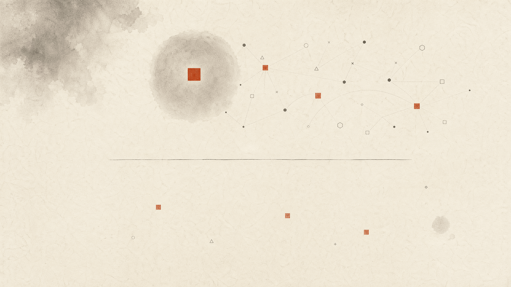
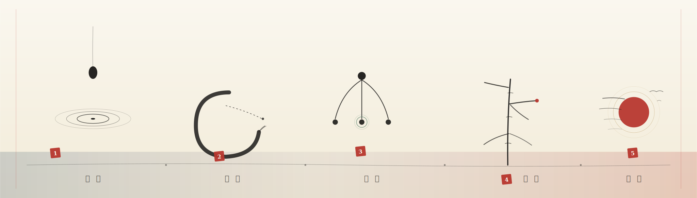
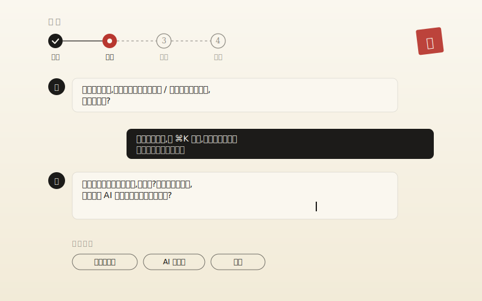
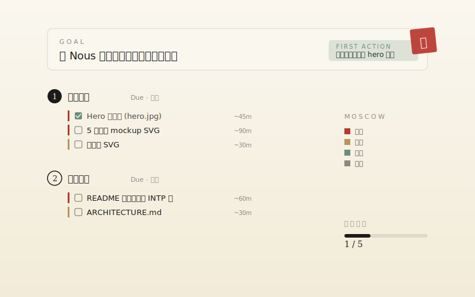
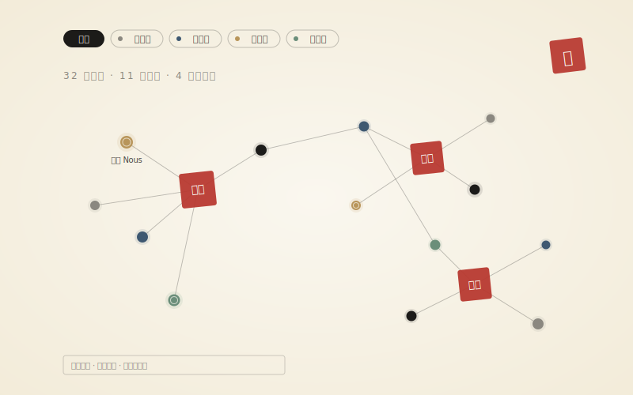
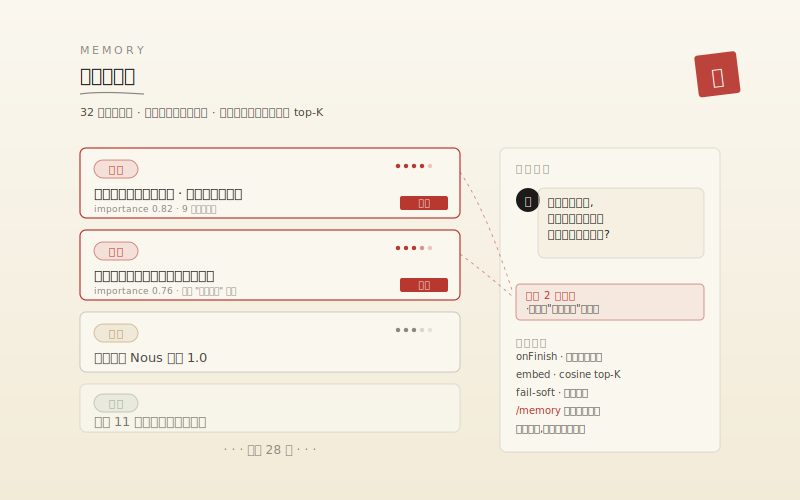
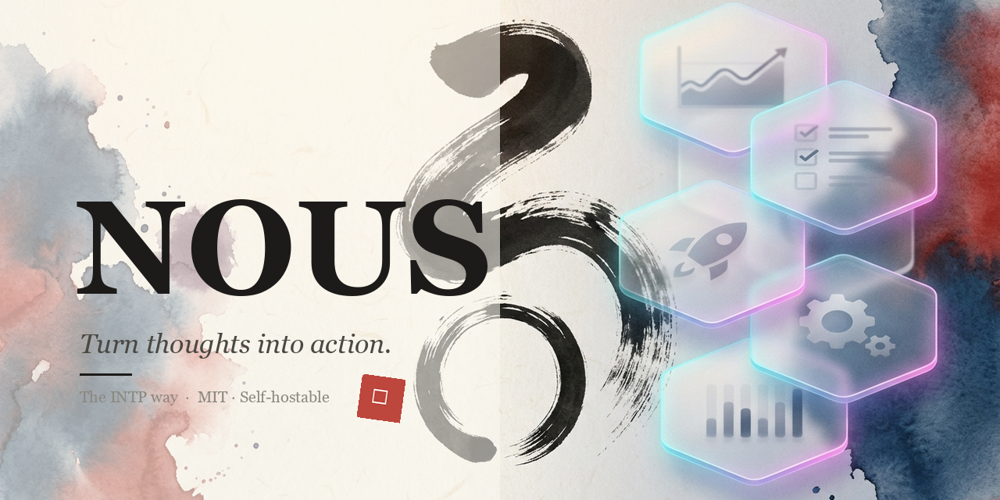

<div align="center">



<br />

### Nous

<sub>νοῦς / nuːs / 纯粹智性</sub>

<p><em>让想法，落地 —— 给想得多、做得少的人。</em></p>

<p>
  <a href="./LICENSE"></a>
  <a href="./docs/SELF_HOSTING.md"></a>
  <a href="https://github.com/qiuxinyuan321/nous/releases"></a>
  <a href="https://github.com/qiuxinyuan321/nous/stargazers"></a>
</p>

<sub>
  <a href="#为什么-nous">为什么</a> ·
  <a href="#六位智者--智性相伴">六位智者</a> ·
  <a href="#核心五能">核心五能</a> ·
  <a href="#怎么跑">怎么跑</a> ·
  <a href="https://github.com/qiuxinyuan321/nous/discussions">讨论</a> ·
  <a href="#english">EN</a>
</sub>

<br /><br />

<sub>最新 · <a href="https://github.com/qiuxinyuan321/nous/releases/tag/v0.4.0"><code>v0.4.0</code></a> · 智性相伴，一路同行 · 六位智者 · Chronicle 时间线 · Proactive 主动问 · Omni-Search · RelationRail</sub>

</div>

---

<h2 id="为什么-nous">为什么 Nous</h2>

想得多，做得少。

清单工具只收集不追问；聊天工具愿意聊但不收口。中间缺一个东西——**在动手前，把意图问清楚**。

Nous 做这个。不给鸡汤，只给逻辑框架、边界、和一个十五分钟能开始的第一步。

<sub><em>为什么只对 INTP 友好 —— 因为它不用情绪推动你，用收口。</em></sub>

---

## 不是另一个清单

<table>
<tr>
<td width="50%" valign="top">

**问，而不是建议。**

AI 按 `意图 → 细节 → 边界 → 就绪` 一次只问一个。检测到分析瘫痪时给 2–3 个选项让你挑，而不是再多问一句。

</td>
<td width="50%" valign="top">

**记得你是谁。**

对话结束后抽取稳定事实（偏好 / 习惯 / 目标 / 盲点），下轮按相似度注入。越用越懂你，`/memory` 页随时读 / 删。

</td>
</tr>
<tr>
<td valign="top">

**交给你一把刀。**

对话完不给鼓励，给一棵树——目标、里程碑、任务、MoSCoW、一个 15 分钟能动手的第一步。卡住点"我卡了"，给 3 个突破。

</td>
<td valign="top">

**你的服务器，你的 Key。**

MIT、2C2G VPS、Docker Compose。AES-256-GCM 加密的 API Key 只在你自己的数据库里。想跑哪家模型跑哪家。

</td>
</tr>
</table>

---

<h2 id="六位智者--智性相伴">六位智者 · 智性相伴</h2>

<div align="center">

</div>

与其选一种"AI 语气"，不如选一位**同行者**。

| 印 | 人物 | 风格 | 一句话口吻 |
|:-:|:--|:--|:--|
| 羽 | **诸葛亮** | 谋士 · 文言温厚 | 「此事需从三处拆：其一……」 |
| R | **Rick** | C-137 · *打嗝* · 虚无主义 | 「Morty, this is stupid. _burp_ Why would you—」 |
| 楚 | **楚轩** | 无限恐怖 · 代价必须合理 | 「这个方案的真实代价 — 你计算过了吗？」 |
| Σ | **苏格拉底** | 反诘 · 我一无所知 | 「那么朋友 · 若 X 为真 · Y 又如何解释？」 |
| 鲲 | **庄子** | 寓言 · 相对 · 逍遥 | 「子非鱼 · 此事可以换个角度……」 |
| H | **Holmes** | 观察 · 演绎 · 排除不可能 | 「Observation: you've been avoiding this.」 |

每位智者贯穿**工作台问候 → 4 阶段对话 → 方案生成 → 主动提问**全流程，用他的思维方式陪你走完这一轮。`Refine 页 → 下拉` 随时切换，**切过的那个 idea 会记得他**。

---

## 核心五能

### 01 · 智性相伴 · 六印随行

详见上文。`v0.4.0` 起 persona 信息随每条 assistant message 持久化，方案页标出「由 诸葛亮 拟定」，Chronicle 标出「Holmes 回应」——**是谁在说，始终可溯源**。

### 02 · Proactive · AI 开始主动问你

不再等你来问。合适的时机轻敲一下门：

- **Zombie Idea** · 「你说过想做这件事，搁置一周多了」
- **Stalled Plan** · 「这个方案上次推进是 10 天前」
- **Hoarding** · 「这周记了 14 个新想法，只深入了 2 个」
- **Orphan Goal** · 「你提过想……但它还没有 plan」
- **Dormant Blindspot** · 「上次我们提过 X，你后来想清楚了吗」
- **Seasonal Review** · 周日 · 新月 · 节气转折 · 主动邀你复盘

每条由你选的智者重写成他的口吻。7 天内同 key 不重提。

### 03 · Chronicle · 你的思维时间线

<div align="center">

</div>

一屏看到所有**想过的 / 做过的 / 记过的**事——想法落笔、笔记更新、对话轮次、复盘生成、记忆沉淀、任务完成。日 / 周 / 月三维切换，每条 AI 回应显示具体智者名。

### 04 · Omni-Search · 一次搜五类

<div align="center">

</div>

`⌘⇧K` 进入深度搜索——**想法 · 笔记 · 消息 · 复盘 · 记忆**同时扫描，全文检索 + 向量相似混合打分，相关片段高亮。支持 `idea:` / `note:` / `tag:` 前缀过滤。

### 05 · RelationRail · 关联网

每个想法、笔记、复盘的右侧有一条关联栏——**同主题想法 · 指向它的任务 · 同源对话 · 同时段事件 · AI 沉淀的相关记忆**，双向跳转。

```
关联 · 15 项
┌─ → 指向        ─ 5 项 · 任务 / 笔记
├─ ⋯ 同源        ─ 5 项 · 来自同一想法的对话
├─ ◴ 同时段      ─ 5 项 · 同一天的其他活动
└─ ✦ 语义相近    ─ 由 embedding 召回
```

你在 Nous 里写的东西，不再是孤岛。

---

## 四阶段流程

<div align="center">
  
</div>

---

## 几处界面

<table>
<tr>
<td width="50%">

<p align="center"><sub><b>工作台</b> · 4 张 StatCard + SparkLine + Proactive 卡片 · 今日聚焦</sub></p>
</td>
<td width="50%">

<p align="center"><sub><b>对话</b> · 意图 / 细节 / 边界 / 就绪 · 四阶段 · 一次只问一个</sub></p>
</td>
</tr>
<tr>
<td>

<p align="center"><sub><b>方案</b> · 目标 / 里程碑 / 任务树 / MoSCoW · 一键聚焦 N 件必做</sub></p>
</td>
<td>

<p align="center"><sub><b>图谱</b> · 力导向 Idea ↔ Tag · 拖拽 + 滚轮缩放</sub></p>
</td>
</tr>
<tr>
<td>

<p align="center"><sub><b>记忆</b> · 对话结束抽取稳定事实 · 下轮按相似度注入</sub></p>
</td>
<td>

<p align="center"><sub><b>复盘</b> · 完成率环 + 周节奏 · 做了 / 卡在 / 洞察 / 下周一件</sub></p>
</td>
</tr>
</table>

---

## 水墨设计语言

水墨。宣纸底、浓墨字、朱砂印落决断。

| 色 | 值 | 用 |
|---|---|---|
| 宣纸 `--paper-rice` | `#FAF7EF` | 背景 |
| 陈纸 `--paper-aged` | `#F2EBD8` | 容器 |
| 浓墨 `--ink-heavy` | `#1C1B19` | 主文 |
| 中墨 `--ink-medium` | `#4A4842` | 次级 |
| 浅墨 `--ink-light` | `#8B8880` | 辅助 |
| 朱砂 `--cinnabar` | `#B8372F` | 印 · 强调 |
| 青釉 `--celadon` | `#6B8E7A` | 成 |
| 青石 `--indigo-stone` | `#3E5871` | 链接 |
| 泥金 `--gold-leaf` | `#B8955A` | 高亮 |

5 款内置主题：宣纸、深墨、青瓷、朱金、烟竹。`⌘K → 切换主题` 切换。

所有动效遵循 `prefers-reduced-motion`。

---

<h2 id="怎么跑">怎么跑</h2>

### 本地开发

```bash
# 1 · 克隆 + 装依赖
git clone https://github.com/qiuxinyuan321/nous.git && cd nous
pnpm install

# 2 · 写三个关键环境变量
cp .env.example .env.local   # DATABASE_URL / NEXTAUTH_SECRET / CRYPTO_KEY

# 3 · 起 DB + 跑
pnpm docker:dev              # Postgres + Redis
pnpm prisma:migrate
pnpm dev                     # http://localhost:3000
```

### 自托管 · 2C2G VPS 就够

```bash
cp .env.example .env.prod && vim .env.prod
bash scripts/deploy.sh
```

`deploy.sh` 一次搞定：预检 → 构建镜像 → 拉 Postgres / Redis → 启动 Nginx + Certbot 拿 HTTPS 证书 → 健康检查。

详见 [`SELF_HOSTING`](./docs/SELF_HOSTING.md) · [`AI_PROVIDERS`](./docs/AI_PROVIDERS.md)。

---

## 技术

**Next.js 16** · **React 19** · TypeScript · Prisma + PostgreSQL 16 · Redis 7 · Tailwind v4 · Vercel AI SDK · NextAuth v5 · `cmdk` · `framer-motion` · `d3-force` · Playwright。

几个非常规决定：

- **没全接 shadcn** · 只用 `cmdk`。Tailwind class 直接手写，所有组件共享一套墨色语言。
- **图谱不用 Cytoscape / Sigma** · 只装 `d3-force` 力引擎（~18KB），drag / zoom / 渲染手写。
- **Embedding fail-soft** · 记忆检索拿不到 embedding 时降级按 importance 排序，不阻塞对话。
- **CSS 变量驱动主题 + inline script 防 FOUC** · 主题切换不闪烁。
- **Persona 贯穿全栈** · 每条 assistant message 持久化 personaId，方案页 / Chronicle 可溯源「是谁在说」。

---

## BYOK

OpenAI / Anthropic / DeepSeek / Kimi / Doubao / 任何 OpenAI 兼容网关。

Key 用 AES-256-GCM 加密，主密钥只在服务器环境变量里，数据库看不到明文。

新账号内置 Demo Key，每日 20 次——试一试就能判断是否值得自己配。

---

## 路线

**已做 · v0.4.0** · 捕获 · 对话 · 规划 · 专注 · 周复盘 · 长期记忆 · 图谱 · Obsidian/Notion 同步 · 主题 · Dashboard · ⌘K 命令面板 · PWA · 中英双语 · Docker 部署 · E2E · **六位智者** · **Proactive 主动问** · **Chronicle 时间线** · **Omni-Search** · **RelationRail 关联网**

**在做** · Obsidian 双向同步 · Notion 反向 pull · 自定义主题上传 · 图谱语义边 · 更多智者 · Persona voice 微调

**也许** · CRDT 多端协作 · 情绪标签 · 年度总结 · 移动端原生 · 浏览器插件

---

## 参与 · 许可

<table>
<tr>
<td width="33%" align="center">
<a href="https://github.com/qiuxinyuan321/nous/issues/new/choose"></a>
<br /><sub>发现 bug 或怪味道</sub>
</td>
<td width="34%" align="center">
<a href="https://github.com/qiuxinyuan321/nous/discussions"></a>
<br /><sub>有想法 · 或只是想聊聊</sub>
</td>
<td width="33%" align="center">
<a href="./CONTRIBUTING.md"></a>
<br /><sub>想动手 · 有 PR 模板</sub>
</td>
</tr>
</table>

Conventional commits · `feat:` / `fix:` / `docs:` / `chore:` / `refactor:`。

[MIT](./LICENSE) · 可商用。致谢 · Vercel AI SDK · cmdk · Prisma · Magic UI · Noto Serif SC · Fraunces · JetBrains Mono。

---

<details>
<summary><b id="english">English</b></summary>

<br />

**Nous** (Greek for *pure intellect*).

> Thoughts into action, the INTP way.

A thinking tool for people who think a lot and act rarely. Socratic AI asks one question at a time until the vague idea becomes something you can actually start tonight. Not another to-do list.

**Six canonical minds accompany you.** Zhuge Liang · Rick · Chuxuan · Socrates · Zhuangzi · Holmes — each with their own cinnabar seal, voice layer, and way of asking. Switch per-idea; the one you picked stays with that conversation.

**Proactive.** Nous knocks first when an idea sits zombie for a week, a plan stalls, you're hoarding new thoughts without going deep, or a seasonal review is due. Each nudge rewritten in your chosen persona's voice.

**Chronicle.** One scrolling timeline of everything you've thought, written, and done — ideas, notes, conversations, reflections, memories, tasks. Day / week / month.

**Flow** · `⌘K` capture → Socratic dialogue → plan tree → focus timer → weekly review

**Stack** · Next.js 16 · React 19 · Prisma · Postgres · Redis · Tailwind v4 · Vercel AI SDK · NextAuth · cmdk · Playwright

**Self-host** · 2C2G VPS · Docker Compose · Nginx · Certbot — [guide](./docs/SELF_HOSTING.md)

**BYOK** · OpenAI / Anthropic / DeepSeek / Kimi / any OpenAI-compatible gateway. Keys encrypted with AES-256-GCM.

```bash
git clone https://github.com/qiuxinyuan321/nous.git && cd nous
cp .env.example .env.prod && vim .env.prod
bash scripts/deploy.sh
```

MIT. Commercial-friendly.

</details>

<br />

<div align="center">


<sub>© Nous · 让想法，落地</sub>
</div>
