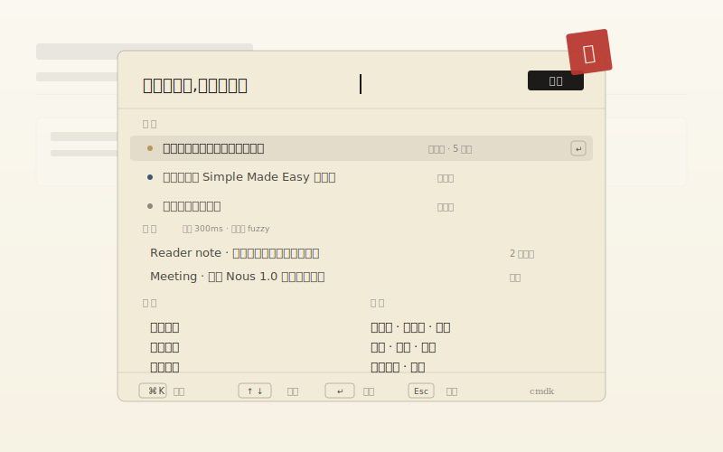
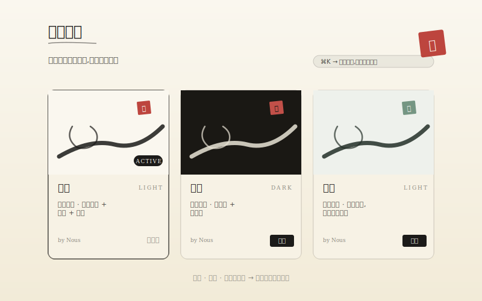

<div align="center">


<br />

### Nous

<sub>νοῦς / nuːs / 纯粹智性</sub>

<p><em>让想法，落地 —— 给想得多、做得少的人。</em></p>

<p>
  <a href="./LICENSE"></a>
  <a href="./docs/SELF_HOSTING.md"></a>
  <a href="https://github.com/qiuxinyuan321/nous/releases"></a>
  <a href="https://github.com/qiuxinyuan321/nous/stargazers"></a>
</p>

<sub>
  <a href="#nous-能做什么">能做什么</a> ·
  <a href="#nous-几处界面">几处界面</a> ·
  <a href="#nous-怎么跑">怎么跑</a> ·
  <a href="#nous-技术">技术</a> ·
  <a href="https://github.com/qiuxinyuan321/nous/discussions">讨论</a> ·
  <a href="#english">English</a>
</sub>

<br /><br />

<sub>最近 · <a href="https://github.com/qiuxinyuan321/nous/releases/tag/v0.3.0"><code>v0.3.0</code></a> · 工作台 Dashboard · ⌘K 命令面板重写 · Playwright 回归</sub>

</div>

---

## 是什么

想的多，做得少。

清单工具只收集不追问；聊天工具愿意聊但不收口。中间缺一个东西——**在动手前，把意图问清楚**。

Nous 做这个。

它不是另一个待办清单。用苏格拉底式追问，把一句"我想做 X"变成今晚就能动手的第一步。

<sub><em>为什么只对 INTP 有意义？—— 因为它不给鸡汤，只给逻辑框架、边界、和一个十五分钟能开始的第一步。情绪推动不了你，收口能。</em></sub>

---

<h2 id="nous-四件事">四件事</h2>

<table>
<tr>
<td width="50%" valign="top">

**问，而不是建议。**

AI 按 `意图 → 细节 → 边界 → 就绪` 一次只问一个。检测到分析瘫痪时给 2–3 个选项让你挑，而不是再多问一句。

</td>
<td width="50%" valign="top">

**记得你是谁。**

对话结束后抽取稳定事实（偏好 / 习惯 / 目标 / 盲点），下轮按相似度注入。越用越懂你，`/memory` 页随时读 / 删。

</td>
</tr>
<tr>
<td valign="top">

**交给你一把刀。**

对话完不给鼓励，给一棵树——目标、里程碑、任务、MoSCoW、一个 15 分钟能动手的第一步。卡住点"我卡了"，给 3 个突破。

</td>
<td valign="top">

**你的服务器，你的 Key。**

MIT、2C2G VPS、Docker Compose。AES-256-GCM 加密的 API Key 只在你自己的数据库里。想跑哪家模型跑哪家。

</td>
</tr>
</table>

---

## 流程

<div align="center">
  
</div>

---

<h2 id="nous-能做什么">能做什么</h2>

**捕获** · 全局 `⌘K`，textarea 或语音（Whisper），`Enter` 落笔。不取名、不分类、不打标签。

**对话** · AI 按 `意图 → 细节 → 边界 → 就绪` 四阶段温和追问。一次只问一个。检测到分析瘫痪时直接给 2–3 个选项让你挑。

**规划** · 对话转结构：目标、里程碑、任务树、MoSCoW 优先级、一个 15 分钟可启动的第一步。

**专注** · 番茄钟 + 今日聚焦面板。卡住时点"我卡了"，AI 基于当前上下文给 3 个突破思路。

**复盘** · 周末一张复盘：完成了什么、卡在哪里、一句话洞察、下周聚焦一件事。

**记忆** · 对话结束后抽取稳定事实（偏好 / 习惯 / 目标 / 盲点）。下轮对话前按相似度注入 prompt。越用越懂你，`/memory` 页可以全部查看和删。

**图谱** · 力导向布局显示 Idea ↔ Tag 关系。不是装饰，用来看念头之间隐性的桥。

**同步** · Obsidian zip 导出（YAML frontmatter + 对话 + 方案）· Notion 单向推送。

---

<h2 id="nous-几处界面">几处界面</h2>

<table>
<tr>
<td width="50%">

<p align="center"><sub><b>捕</b> · <code>⌘K</code> · cmdk 三模式 · 想法 / 笔记 / 操作 / 跳转</sub></p>
</td>
<td width="50%">

<p align="center"><sub><b>问</b> · 意图 / 细节 / 边界 / 就绪 · 一次只问一个</sub></p>
</td>
</tr>
<tr>
<td>

<p align="center"><sub><b>划</b> · 目标 / 里程碑 / 任务树 / MoSCoW · 15 分钟第一步</sub></p>
</td>
<td>

<p align="center"><sub><b>算</b> · 4 张 StatCard + SparkLine + 连续打卡 · 今日聚焦</sub></p>
</td>
</tr>
<tr>
<td>

<p align="center"><sub><b>织</b> · 力导向显示 Idea ↔ Tag · 拖拽 · 滚轮缩放</sub></p>
</td>
<td>

<p align="center"><sub><b>忆</b> · 对话结束抽取稳定事实 · 下轮按相似度注入</sub></p>
</td>
</tr>
<tr>
<td>

<p align="center"><sub><b>省</b> · 完成率环 + 周节奏 · 做了 / 卡在 / 洞察 / 下周一件</sub></p>
</td>
<td>

<p align="center"><sub><b>染</b> · 5 款内置 · CSS 变量驱动 · inline script 防 FOUC</sub></p>
</td>
</tr>
</table>

<sub><em>全部为原生 SVG。Git 里能 diff，浏览器里无抗锯齿衰减，<code>&lt;animate&gt;</code> 写在标签里就动。</em></sub>

---

## 设计

水墨。宣纸底、浓墨字、朱砂印落决断。

| 色 | 值 | 用 |
|---|---|---|
| 宣纸 `--paper-rice` | `#FAF7EF` | 背景 |
| 陈纸 `--paper-aged` | `#F2EBD8` | 容器 |
| 浓墨 `--ink-heavy` | `#1C1B19` | 主文 |
| 中墨 `--ink-medium` | `#4A4842` | 次级 |
| 浅墨 `--ink-light` | `#8B8880` | 辅助 |
| 朱砂 `--cinnabar` | `#B8372F` | 印 · 强调 |
| 青釉 `--celadon` | `#6B8E7A` | 成 |
| 青石 `--indigo-stone` | `#3E5871` | 链接 |
| 泥金 `--gold-leaf` | `#B8955A` | 高亮 |

5 款内置主题：宣纸、深墨、青瓷、朱金、烟竹。`⌘K → 切换主题` 切换。

所有动效遵循 `prefers-reduced-motion`。

---

<h2 id="nous-怎么跑">怎么跑</h2>

### 本地开发

```bash
# 1 · 克隆 + 装依赖
git clone https://github.com/qiuxinyuan321/nous.git && cd nous
pnpm install

# 2 · 写三个关键环境变量
cp .env.example .env.local   # DATABASE_URL / NEXTAUTH_SECRET / CRYPTO_KEY

# 3 · 起 DB + 跑
pnpm docker:dev              # Postgres + Redis
pnpm prisma:migrate
pnpm dev                     # http://localhost:3000
```

### 自托管 · 2C2G VPS 就够

```bash
cp .env.example .env.prod && vim .env.prod
bash scripts/deploy.sh
```

`deploy.sh` 一次搞定：预检 → 构建镜像 → 拉 Postgres / Redis → 启动 Nginx + Certbot 拿 HTTPS 证书 → 健康检查。

详见 [`SELF_HOSTING`](./docs/SELF_HOSTING.md) · [`AI_PROVIDERS`](./docs/AI_PROVIDERS.md)。

---

<h2 id="nous-技术">技术</h2>

Next.js 16 · React 19 · TypeScript · Prisma + PostgreSQL · Redis · Tailwind v4 · Vercel AI SDK · NextAuth v5 · `cmdk` · `framer-motion` · `d3-force` · Playwright。

几个非常规决定：

- **没全接 shadcn** · 只用 `cmdk`。Tailwind class 直接手写，保证所有组件共享一套墨色语言。
- **图谱不用 Cytoscape / Sigma** · 只装 `d3-force` 的力引擎（~18KB），drag / zoom / 渲染手写。
- **embedding fail-soft** · 记忆检索的 embedding 拿不到时，降级按 importance 排序，不阻塞对话。
- **CSS 变量驱动主题 + inline script 防 FOUC** · 主题切换不闪烁。

---

## BYOK

OpenAI / Anthropic / DeepSeek / Kimi / Doubao / 任何 OpenAI 兼容网关。

Key 用 AES-256-GCM 加密，主密钥只在服务器环境变量里，数据库看不到明文。

新账号内置 Demo Key，每日 20 次——试一试就能判断是否值得自己配。

---

## 路线

**已做** · 捕获 · 对话 · 规划 · 专注 · 周复盘 · 长期记忆 · 图谱 · Obsidian/Notion 同步 · 主题 · Dashboard · 命令面板 · PWA · 中英双语 · Docker 部署 · E2E

**在做** · Obsidian 双向同步 · Notion 反向 pull · 自定义主题上传 · 图谱语义边

**也许** · CRDT 多端协作 · 情绪标签 · 年度总结 · 移动端原生 · 浏览器插件

---

## 参与

<table>
<tr>
<td width="33%" align="center">
<a href="https://github.com/qiuxinyuan321/nous/issues/new/choose"></a>
<br /><sub>发现 bug 或怪味道</sub>
</td>
<td width="34%" align="center">
<a href="https://github.com/qiuxinyuan321/nous/discussions"></a>
<br /><sub>有想法 · 或只是想一起聊聊</sub>
</td>
<td width="33%" align="center">
<a href="./CONTRIBUTING.md"></a>
<br /><sub>想动手 · 有 PR 模板和风格约定</sub>
</td>
</tr>
</table>

Conventional commits · `feat:` / `fix:` / `docs:` / `chore:` / `refactor:`。

---

## 许可

[MIT](./LICENSE) · 可商用。

致谢 · Vercel AI SDK / cmdk · Prisma · Magic UI（Aurora / Border Beam / Shimmer / Number Ticker 四个组件的思路来自它，Nous 按墨色语言重写）· Noto Serif SC / Fraunces / JetBrains Mono。

---

<details>
<summary><b>English</b></summary>

<br />

**Nous** (Greek for *pure intellect*).

> Thoughts into action, the INTP way.

A thinking tool for people who think a lot and act rarely. Socratic AI asks one question at a time until the vague idea becomes something you can actually start tonight.

Not another to-do list.

**Flow** · `⌘K` capture → dialogue → plan → focus → weekly review

**Stack** · Next.js 16, Prisma, Postgres, Redis, Tailwind v4, Vercel AI SDK, NextAuth, cmdk, Playwright

**Self-host** · 2C2G VPS, Docker Compose, Nginx, Certbot — [guide](./docs/SELF_HOSTING.md)

**BYOK** · OpenAI / Anthropic / DeepSeek / Kimi / any OpenAI-compatible gateway. Keys encrypted with AES-256-GCM.

```bash
git clone https://github.com/qiuxinyuan321/nous.git && cd nous
cp .env.example .env.prod && vim .env.prod
bash scripts/deploy.sh
```

MIT. Commercial-friendly.

</details>

<br />

<div align="center">
<sub>© Nous · 让想法，落地</sub>
</div>
